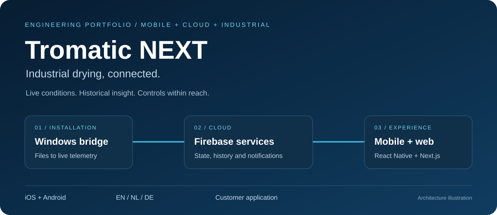
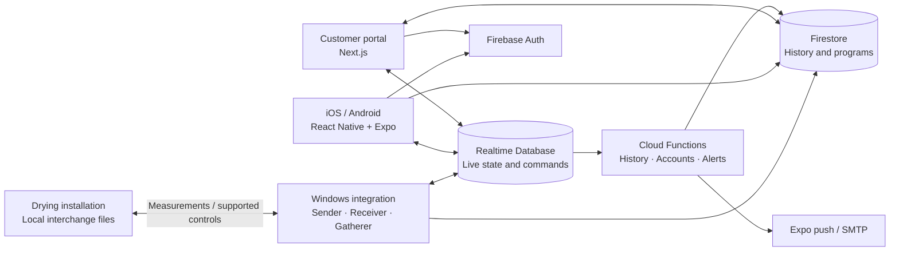

# Tromatic NEXT

A mobile companion for industrial wood-drying installations: monitor chamber conditions, inspect drying history, and adjust supported controls from iOS or Android. A web portal handles customer administration, while a Windows integration connects the software to on-site machinery.

**Published for customers:** [App Store](https://apps.apple.com/us/app/tromatic-next/id6476465551) · [Google Play](https://play.google.com/store/apps/details?id=nl.besbollmann.tromaticnext&hl=en)

The store apps require an authorized customer account and a connected installation. They are not a public demo. This repository presents the engineering and source code; it does not include customer access, production configuration, or a turnkey backend.

## What the application does

- **Monitor a chamber:** temperature, humidity, wood-moisture probes, fan state, and drying progress.
- **Inspect trends:** historical measurements rendered as charts alongside current readings.
- **Adjust supported settings:** offsets, probe selection, and program controls through the machine integration.
- **Keep users informed:** localized alarm/status notifications and account emails.
- **Manage access:** company, machine, and user administration in the web portal.
- **Serve multiple languages:** English, Dutch, and German resources across the mobile and web clients.

## Engineering at a glance

| Area | Implementation | Where to explore |
| --- | --- | --- |
| Cross-platform mobile | React Native, Expo, React Navigation | [App navigation](App/navigation/AppNavigator.js) |
| State and persistence | Redux Toolkit, Redux Persist, AsyncStorage | [State store](App/store/store.js) |
| Data visualization | Victory Native charts and custom sensor components | [Graph screen](App/screens/GraphScreen.js), [components](App/components) |
| Web application | Next.js App Router, Tailwind CSS, next-intl | [Customer portal](Web/app/%5Blocale%5D/portal) |
| Event-driven backend | Firebase Auth, Realtime Database, Firestore, Cloud Functions | [Backend functions](Functions/functions/index.js) |
| Industrial integration | Node.js file watchers, change detection, Windows services | [Sender](Comms-js/sender.js), [receiver](Comms-js/receiver.js), [gatherer](Comms-js/gatherer.js) |

## How the pieces connect

[Read the architecture walkthrough](docs/ARCHITECTURE.md) for the telemetry cycle, design choices, and boundaries.

## Explore locally

Each directory has its own package manifest and lockfile. There is no root install command.

| Component | Setup | Needs |
| --- | --- | --- |
| Mobile | [App/README.md](App/README.md) | A compatible Expo environment and your own Firebase project |
| Portal | [Web/README.md](Web/README.md) | Node.js and your own Firebase project |
| Integration | [Comms-js/README.md](Comms-js/README.md) | Windows and development interchange folders |
| Backend | [Functions/README.md](Functions/README.md) | A separately configured Firebase development project |

Copy the relevant `.env.example` to a local `.env` (the portal uses `.env.local`) and supply your own values. Examples contain placeholders only. Firebase client configuration is bundled into clients; server credentials belong only in server environments.

## Scope and limitations

This is a portfolio snapshot of a customer application. The source includes integration and administration code, but Hardened Firebase rules are included; initial provisioning and the machine-side software are not. A fresh clone cannot reproduce a complete installation. The checked-in dependency versions reflect the original implementation and require maintenance before a new production deployment. No automated end-to-end test suite is included.

The repository demonstrates mobile UI, data visualization, localization, web administration, asynchronous cloud workflows, and integration with existing industrial systems. It makes no claim that client-side role checks replace backend authorization.

## Publication and security

The repository history has been sanitized while retaining its commit sequence and branches, and both GitHub branches have been updated. See [publication notes](docs/PUBLICATION.md) for verification scope and remaining publication checks. [Firebase rule review](docs/FIREBASE_RULES.md) records the hardened policy and integration changes.

[Security reporting](SECURITY.md) · [Contribution guidance](CONTRIBUTING.md)

Product names and brand assets identify the application. No new license or rights to third-party branding are granted by this portfolio preparation.
