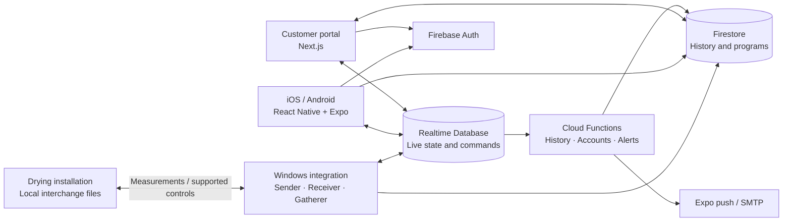
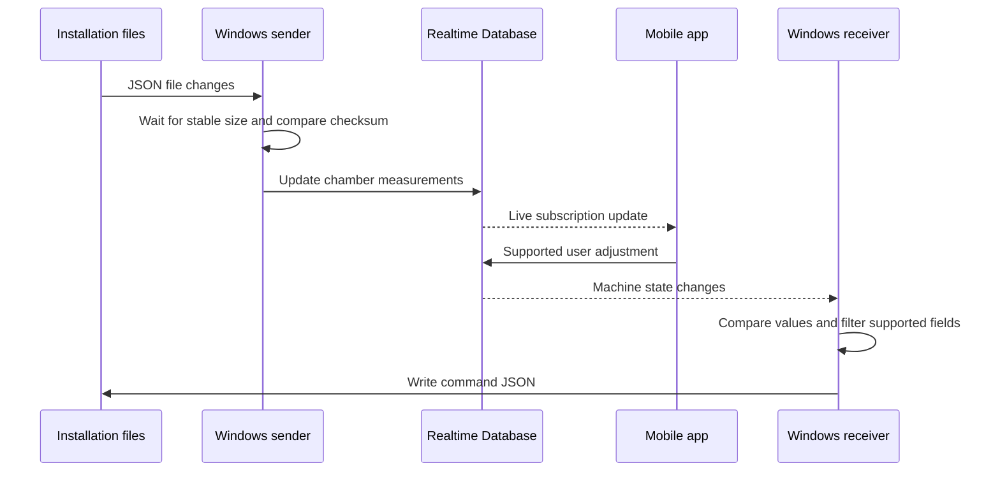

# Tromatic NEXT

A mobile companion for industrial wood-drying installations: monitor chamber conditions, inspect drying history, and adjust supported controls from iOS or Android. A web portal handles customer administration, while a Windows integration connects the software to on-site machinery.

**Published for customers:** [App Store](https://apps.apple.com/us/app/tromatic-next/id6476465551) · [Google Play](https://play.google.com/store/apps/details?id=nl.besbollmann.tromaticnext&hl=en)

The store apps require an authorized customer account and a connected installation. They are not a public demo. This repository presents the engineering and source code, it does not include customer access, production configuration, or a turnkey backend.

## What the application does

- **Monitor a chamber:** temperature, humidity, wood-moisture probes, fan state, and drying progress.
- **Inspect trends:** historical measurements rendered as charts alongside current readings.
- **Adjust supported settings:** offsets, probe selection, and program controls through the machine integration.
- **Keep users informed:** localized alarm/status notifications and account emails.
- **Manage access:** company, machine, and user administration in the web portal.
- **Serve multiple languages:** English, Dutch, and German resources across the mobile and web clients.

## Engineering at a glance

| Area | Implementation | Where to explore |
| --- | --- | --- |
| Cross-platform mobile | React Native, Expo, React Navigation | [App navigation](App/navigation/AppNavigator.js) |
| State and persistence | Redux Toolkit, Redux Persist, AsyncStorage | [State store](App/store/store.js) |
| Data visualization | Victory Native charts and custom sensor components | [Graph screen](App/screens/GraphScreen.js), [components](App/components) |
| Web application | Next.js App Router, Tailwind CSS, next-intl | [Customer portal](Web/app/%5Blocale%5D/portal) |
| Event-driven backend | Firebase Auth, Realtime Database, Firestore, Cloud Functions | [Backend functions](Functions/functions/index.js) |
| Industrial integration | Node.js file watchers, change detection, Windows services | [Sender](Comms-js/sender.js), [receiver](Comms-js/receiver.js), [gatherer](Comms-js/gatherer.js) |

## How the pieces connect

Tromatic NEXT connects a file-based installation interface with mobile and web clients. The boundaries are visible in four independently installed packages.

### Telemetry and control

The sender delays reading until file size stabilizes and uses an MD5 checksum to suppress repeated file events. The receiver filters changed fields and writes CRLF-formatted JSON for the local integration. The gatherer parses drying-program files and writes program headers and phases to Firestore in batches.

### Live state and history

Realtime Database supplies current machine state. A scheduled Cloud Function copies measurements into Firestore history, which the mobile graph screen consumes. This separates a changing operational view from historical readings. Status-change handlers translate alarm bits into localized messages for push notifications.

### Boundaries worth reviewing

- The Windows bridge requires an authenticated integration account and local machine files. It is not a general-purpose public API or simulator.
- A complete installation also needs account provisioning, machine-side software, and configured cloud services.

## Firebase rules

[Realtime Database rules](Functions/database.rules.json) and [Firestore rules](Functions/firestore.rules) define the access model. Both are referenced by [the Firebase configuration](Functions/firebase.json).

### Access model

| Resource | Access |
| --- | --- |
| Company data | Realtime Database members read their own company; Firestore company/program documents require a company admin; company admins manage supported fields |
| Live machine state | Members read machines registered to their company; company admins write existing machine state without changing its company or deleting the entire machine |
| Profiles | Users update allowed profile fields; company admins manage supported fields for existing users in the same company |
| Roles | Company admins manage non-owner roles for other existing users in their company; owner privileges require an owner or trusted server operation |
| Historical telemetry | Approved viewers, editors, and admins read history for machines in their company; ordinary clients cannot write history |
| Firestore account documents | Owner/server reads only because these documents contain account-action tokens; clients display profile data from Realtime Database |
| Provisioning | Company creation, account creation/deletion, company transfers, and machine creation use an owner account or the Admin SDK |

Unauthenticated database access is denied. Owners retain cross-company administration. Client profile updates cannot change company assignments or account-action tokens. Firestore client profile updates are limited to name and email.

Authorization compares the caller's company with the requested company or machine. Firestore role writes validate the proposed fields and prevent non-owners from granting owner privileges. Realtime Database write grants are scoped to specific company children because a parent grant would also authorize writes below it.

Firestore reads return complete documents rather than selected fields, so token-bearing account records are separate from the client-readable profile data. See Firebase's [Realtime Database rule behavior](https://firebase.google.com/docs/database/security) and [Firestore rule conditions](https://firebase.google.com/docs/firestore/security/rules-conditions) for the underlying semantics.

### Machine history metadata

The history scheduler writes `{CID}` to `machines/{machineID}` alongside each history sample. Parent metadata and the sample share a batch, capped at 450 writes. Existing history needs trusted parent metadata before non-owner history queries can succeed. Populate it from verified machine-company mappings or let the scheduler run first. Records with a missing `CID` are skipped.

### Integration requirements

The current mobile self-registration and non-owner portal account creation/deletion flows attempt direct writes to paths protected by these rules. Route those operations through an authorized provisioning service or an owner account before using them in a running installation.

Admin SDK operations bypass database rules. Callable functions therefore need their own authorization checks, including nonempty and unexpired action tokens, an allowlist of requested roles, and validation of the target company. These server endpoints still require a separate authorization review.

The rules have not been deployed or verified with the Firebase emulators. Validate the access model and application flows in a development project before deploying.

## Explore locally

Each directory has its own package manifest and lockfile. There is no root install command.

| Component | Setup | Needs |
| --- | --- | --- |
| Mobile | [App/README.md](App/README.md) | A compatible Expo environment and your own Firebase project |
| Portal | [Web/README.md](Web/README.md) | Node.js and your own Firebase project |
| Integration | [Comms-js/README.md](Comms-js/README.md) | Windows and development interchange folders |
| Backend | [Functions/README.md](Functions/README.md) | A separately configured Firebase development project |

Copy the relevant `.env.example` to a local `.env` (the portal uses `.env.local`) and configure your development project.

## Scope and limitations

The source includes the mobile application, customer portal, cloud functions, database rules, and Windows integration. Initial account provisioning and the machine-side software are separate prerequisites, so a fresh clone does not reproduce a complete installation. The dependency versions reflect the original implementation.

The repository demonstrates mobile UI, data visualization, localization, web administration, asynchronous cloud workflows, and integration with existing industrial systems.
